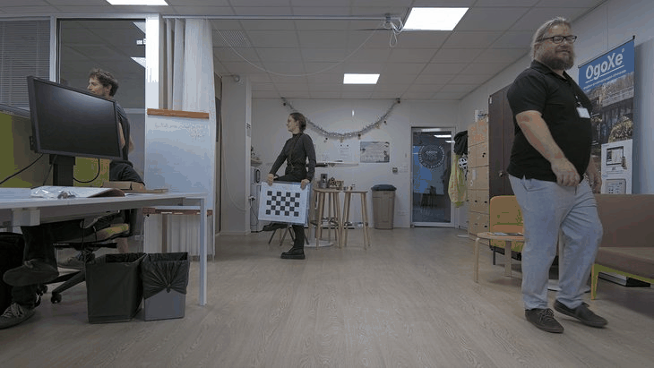

# Waves'N See - calib


Calib stands for the camera calibration procedure.
Distorsion coefficients, focal lengths, and center of optic are computed.

Radial and tangential distorsion factors are taken into account.

For more information about the calibration process, visit [this](https://docs.opencv.org/4.x/d4/d94/tutorial_camera_calibration.html) website.


## Installation
```
uv venv --python 3.12
uv sync

or with --all-groups to install the doc deps too:
uv sync --all-groups
```

## Installation as a uv tool
If user wants to install calib as a uv tool:
```
uv tool install "calib @ git+ssh://git@github.com/wavesnsee/calib"
```

## Usage
Prior to perform camera calibration, make snapshots of the chessboard in different configurations:



In this case, chessboard size is (6,4).

**To run camera calibration:**
```
cd src/calib
python cli/app.py inputdir_snapshots outputdir_calibration  chessboard size_x chessboard size_y
```

**To run camera calibration with calib tool:**
```
calib inputdir_snapshots outputdir_calibration  chessboard size_x chessboard size_y
```
