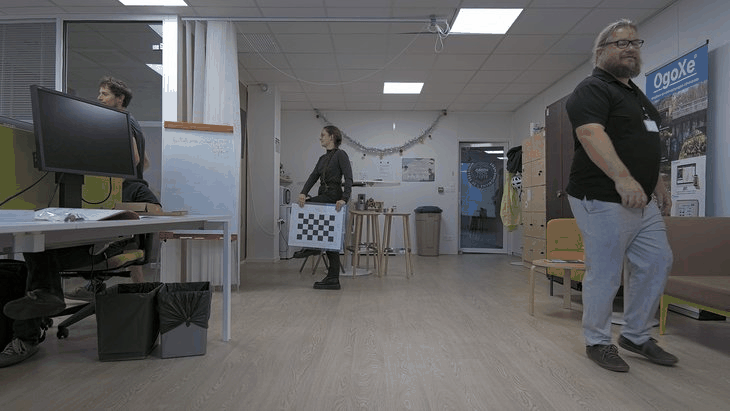

# Waves'N See - calib


Calib stands for the camera calibration procedure.
Distorsion coefficients, focal lengths, and center of optic are computed.

## Installation
```
uv venv --python 3.12
uv sync

or with --all-groups to install the doc deps too:
uv sync --all-groups
```

## Usage
Prior to perform camera calibration, make snapshots of the chessboard in different configurations:



In this case, chessboard size is (6,4).

To run camera calibration:
```
cd src/calib
python cli/app.py input_dir_snapshots output_dir_calibration  chessboard size_x chessboard size_y
```